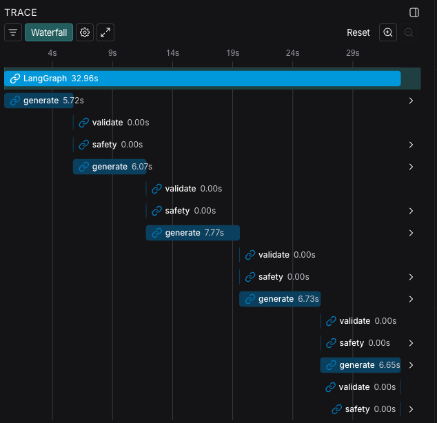

# 🍽️ Meal Plan Generator — AI Engineer Challenge

Este projeto implementa um sistema robusto de geração de planos alimentares guiado por validação, baseado em dados nutricionais específicos de pacientes.

A solução foi desenhada com uma **mentalidade de engenharia de IA orientada à produção**, focando em:

- Arquitetura limpa e modular.
- Validação determinística.
- Robustez no uso de modelos de linguagem menores (SLMs).
- Explicabilidade e observabilidade do fluxo.

---

## Configuração do Ambiente

### 1. Ambiente Virtual (Recomendado)

Crie e ative um ambiente isolado para garantir a consistência das dependências:

```bash
python3 -m venv .venv
source .venv/bin/activate
```

### 2. Instalação de Dependências

Instale os pacotes necessários via pip:

```bash
pip install -r requirements.txt
```

### 3. Configuração de Variáveis de Ambiente

O projeto utiliza um arquivo `.env` para gerenciar chaves de API e configurações de rastreamento.

1. Copie o arquivo de exemplo: `cp .env.example .env`
2. Preencha as chaves obrigatórias:

- `OPENAI_API_KEY`: Sua chave de acesso à API.
- `LANGSMITH_API_KEY`: Para monitoramento e debug (opcional, mas recomendado).

---

## Execução do Agente

### Arquivos de Entrada

O sistema processa dois arquivos fundamentais na raiz do projeto:

- `input_nutri_approval.jsonl`: Perfis dos pacientes, metas nutricionais, preferências e histórico médico.
- `input_lists.jsonl`: Listas de alternativas alimentares com equivalentes nutricionais e IDs de alimentos.

### Execução da Pipeline

Para iniciar o processo de geração, execute:

```python
python3 -m src.main
```

### Saídas (Outputs)

Os planos alimentares gerados são salvos individualmente no diretório `outputs/` em formato JSON (ex: `paciente_1.json`). Cada arquivo é independente e reprodutível.

---

## Estratégia de Prompt e Arquitetura

A estratégia de prompt é **rigorosa**, delegando a lógica complexa para validadores em código.

### 1. Prompt do Sistema

O prompt define regras inegociáveis para garantir que a saída seja legível por máquinas:

- Saída estritamente em **JSON válido**.
- Aderência exata ao **schema** (refeições, grupos de escolha, itens selecionados).
- Inclusão obrigatória de **Food IDs** para interoperabilidade.
- Proibição de inventar totais nutricionais ou violar restrições médicas.

### 2. Contexto do Paciente

Cada chamada ao modelo é enriquecida com dados granulares:

- **Metas Rígidas:** Calorias, macros e fibras.
- **Contexto Adaptativo:** Preferências, alergias, intolerâncias e rotinas alimentares.
- **Separação de Restrições:** O código impõe os limites numéricos, enquanto o LLM foca-se na criatividade e composição do plano.

### 3. Iteração Guiada por Validação

O sistema não espera que o modelo se auto-corrija sozinho.

- **Validadores Python:** Verificam matematicamente se o plano atende às metas.
- **Feedback Estruturado:** Se um plano falha, o sistema envia o erro exato de volta ao modelo para uma nova tentativa limitada.
- **Robustez:** Essa abordagem garante confiabilidade mesmo utilizando modelos menores e mais baratos.

---

## Observability with LangSmith

The system integrates LangSmith to provide full observability over the LangGraph execution.



The trace shows the complete generation–validation–retry workflow, including:

- multiple LLM generation attempts
- deterministic validation and safety checks
- bounded retries
- per-step latency visibility

This confirms the robustness of the architecture and its ability to operate reliably with a Small Language Model.
